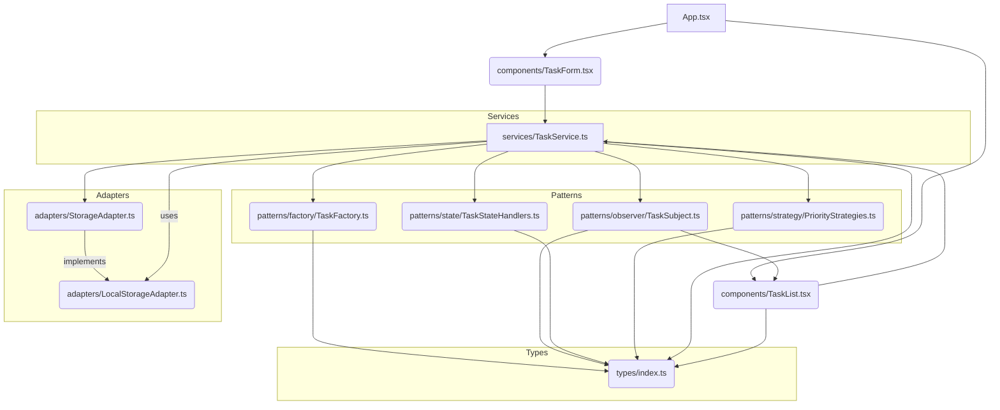

# To-Do List Application
---

## Опис

Гнучкий і розширюваний застосунок **To-Do List**, створений з використанням **React**, **TypeScript** та **Material-UI**. Додаток реалізує шаблони проєктування для керування станами завдань, пріоритетами та оновленням інтерфейсу.

---

## Функціонал

- Додавання,  редагування та видалення завдань
- Встановлення пріоритетів (**Високий | Середній | Низький**)
- Керування станами завдань (**Нове | В процесі | Завершене | Відкладене**)
- Фільтрація за станами
- ↕Сортування за пріоритетом або датою створення

---

## Використані шаблони проєктування

| Шаблон        | Тип            | Призначення                                                      | Використання                         |
|---------------|----------------|-------------------------------------------------------------------|--------------------------------------|
| **State**  | Поведінковий   | Керує станами завдань та їх переходами                           | Зміна статусу: Нове → Завершене     |
| **Strategy** | Поведінковий | Обробка відображення та поведінки пріоритетів                    | Відображення кольорів пріоритетів   |
| **Factory** | Генеративний  | Створення завдання з типовими значеннями                         | Швидке формування нового завдання   |
| **Observer** | Поведінковий | Сповіщає компоненти UI про зміни даних                           | Оновлення списку завдань            |

---

## Single Responsibility Principle (SRP)

**Визначення**:  Клас повинен мати лише одну причину для зміни.

**Застосування**: 
*   `TaskService` зосереджений виключно на бізнес-логіці завдань (створення, оновлення, видалення, зміна стану) та управлінні колекцією завдань, делегуючи зберігання `StorageAdapter` а обробку станів —  `TaskStateHandlers`.
*   `TaskFactory` відповідає лише за створення об'єктів `Task`.
*   Кожен `TaskStateHandler` відповідає лише за обробку конкретного стану завдання.
*   Кожен `PriorityStrategy` відповідає лише за визначення поведінки для конкретного рівня пріоритету.


## Uml Diagram 




### Передумови

- **Node.js** `v14` або вище
- **npm** або **yarn**

### Інсталяція

```bash
git clone https://github.com/your-username/todo-list-app.git
cd todo-list-app
npm install
npm run
```
# Тестування

У проєкті реалізовані **модульні тести (unit tests)** для перевірки основних функцій застосунку:

- **tests/** — каталог з тестами
- Перевіряються:
  - Створення нового завдання
  - Оновлення статусу завдання
  - Видалення завдань
  - Фільтрація та сортування
  - Збереження/завантаження з `localStorage`

### ▶️ Запуск тестів

```bash
npm test
# або
yarn test
