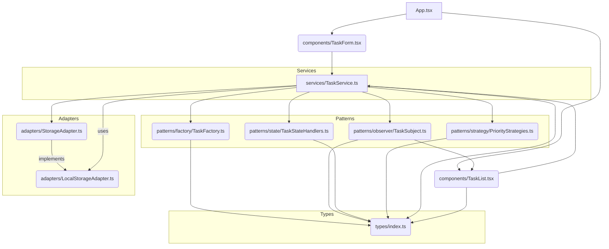

# To-Do List Application
---

## Опис

Гнучкий і розширюваний застосунок **To-Do List**, створений з використанням **React**, **TypeScript** та **Material-UI**. Додаток реалізує шаблони проєктування для керування станами завдань, пріоритетами та оновленням інтерфейсу.

---

## Функціонал

- Додавання,  редагування та видалення завдань
- Встановлення пріоритетів (**Високий | Середній | Низький**)
- Керування станами завдань (**Нове | В процесі | Завершене | Відкладене**)
- Фільтрація за станами
- ↕Сортування за пріоритетом або датою створення

---

## Використані шаблони проєктування

| Шаблон        | Тип            | Призначення                                                      | Використання                         |
|---------------|----------------|-------------------------------------------------------------------|--------------------------------------|
| **State**  | Поведінковий   | Керує станами завдань та їх переходами                           | Зміна статусу: Нове → Завершене     |
| **Strategy** | Поведінковий | Обробка відображення та поведінки пріоритетів                    | Відображення кольорів пріоритетів   |
| **Factory** | Генеративний  | Створення завдання з типовими значеннями                         | Швидке формування нового завдання   |
| **Observer** | Поведінковий | Сповіщає компоненти UI про зміни даних                           | Оновлення списку завдань            |

---

## SOLID

S — Single Responsibility Principle

Кожен клас має одну чітко визначену відповідальність:

UserFacade — логіка реєстрації, входу, виходу, email-сповіщень та управління замовленнями.

BikeFacade — створення велосипеда та пов’язаного замовлення.

BikeBuilder / ElectricBikeBuilder / BikeDirector — побудова об'єкта Bike.

NotifierContext — виконує лише функції сповіщення.

O — Open/Closed Principle

Код відкритий до розширення, але закритий до модифікації:

Додати новий тип велосипеда можна, реалізувавши новий клас Builder.

Додати нову стратегію сповіщень — просто підключити нову стратегію без зміни існуючого коду.

L — Liskov Substitution Principle

Усі підкласи BikeBuilder (наприклад, ElectricBikeBuilder) можуть використовуватись замість базового класу без порушення логіки.
I — Interface Segregation Principle

Класи реалізують лише ті методи, які їм потрібні. Немає зайвих або порожніх методів.
D — Dependency Inversion Principle

UserFacade працює з абстракцією NotifierContext, а не напряму з EmailNotificationStrategy.

BikeDirector отримує Builder як залежність, що дозволяє легко підмінювати реалізацію.


## Uml Diagram 




### Передумови

- **Node.js** `v14` або вище
- **npm** або **yarn**

### Інсталяція

```bash
git clone https://github.com/your-username/todo-list-app.git
cd todo-list-app
npm install
npm run
```
# Тестування

У проєкті реалізовані **модульні тести (unit tests)** для перевірки основних функцій застосунку:

- **tests/** — каталог з тестами
- Перевіряються:
  - Створення нового завдання
  - Оновлення статусу завдання
  - Видалення завдань
  - Фільтрація та сортування
  - Збереження/завантаження з `localStorage`

### ▶️ Запуск тестів

```bash
npm test
# або
yarn test
